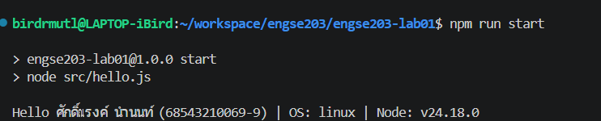

# ENGSE203 LAB 01 — <Developer Environment & GitHub Repository Setup>

## ผู้จัดทำ

- ชื่อ-นามสกุล: ศักดิ์ณรงค์ นำนนท์ / Saknarong namnon
- รหัสนักศึกษา: 68543210069-9
- ระบบปฏิบัติการที่ใช้: macOS / Windows 11 (ใช้งานผ่าน Ubuntu 24.04 LTS บน WSL 2)

## วัตถุประสงค์ของงาน

- ตรวจสอบและใช้งาน Node.js, npm, Visual Studio Code และ Git ผ่าน Terminal ใน Ubuntu WSL 2
- สร้างโครงสร้างโครงงาน JavaScript เบื้องต้น (package.json และ src/hello.js)
- จัดทำ GitHub Repository พร้อมทำการ Commit และ Push งานผ่าน SSH
- จัดทำ README เพื่อบันทึกหลักฐานการเรียนรู้และขั้นตอนการทำงาน

## เครื่องมือที่ใช้

- Visual Studio Code (พร้อม Extension: WSL, ESLint, Prettier, REST Client)
- Node.js LTS (ติดตั้งผ่าน nvm)
- Git (สำหรับ Version Control)
- GitHub (สำหรับ Repository Hosting)

## วิธีติดตั้งและรัน

```bash
# ตัวอย่างคำสั่ง
npm install
npm run start
```

## โครงสร้างไฟล์

```text
.
├── src/
├── package.json
└── README.md
```

## หลักฐานผลลัพธ์

อธิบายผลลัพธ์ พร้อมแนบภาพหน้าจอหรือข้อความผลลัพธ์ตามที่ใบงานกำหนด



## ปัญหาที่พบและวิธีแก้ไข

- ปัญหา: ไม่สามารถใช้งานคำสั่ง code . จาก Terminal ใน Ubuntu WSL ได้ เนื่องจากระบบไม่รู้จัก Path ของ VS Code
- วิธีแก้:  ค้นหาตำแหน่งไฟล์ code.cmd ด้วยคำสั่ง find และทำการตั้งค่า alias ในไฟล์ 
~/.bashrc ให้ชี้ไปยังตำแหน่งไฟล์ที่ถูกต้อง เพื่อให้เรียกใช้งานผ่าน Terminal ใน WSL ได้สำเร็จ

## References & AI Assistance

- Source / Documentation: คู่มือ Setup (WSL 2 + Ubuntu 24.04 LTS) ของรายวิชา ENGSE203
- AI tool used: Gemini
- Used for: ช่วยเหลือในการแก้ไขปัญหาการติดตั้งและการตั้งค่าคำสั่ง code . ใน WSL Terminal และตรวจสอบขั้นตอนการทำ LAB
- My adaptation: ทำความเข้าใจคำสั่ง alias ใน Linux และปรับปรุง Path ให้ตรงกับเครื่องของตนเองตามคำแนะนำของ AI เพื่อให้สามารถเปิด VS Code ได้โดยตรงจาก Terminal ในโฟลเดอร์งาน